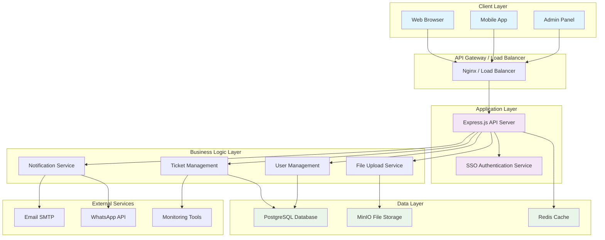
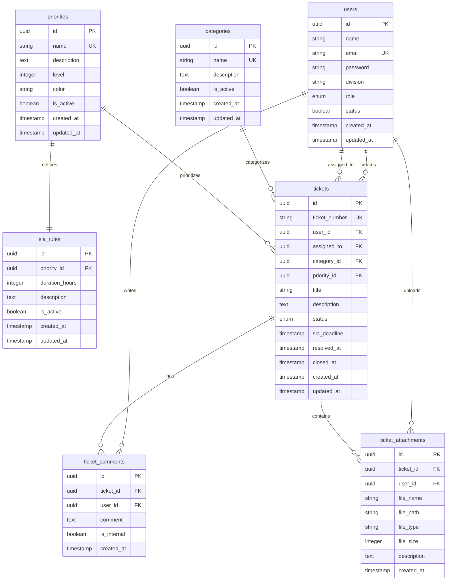
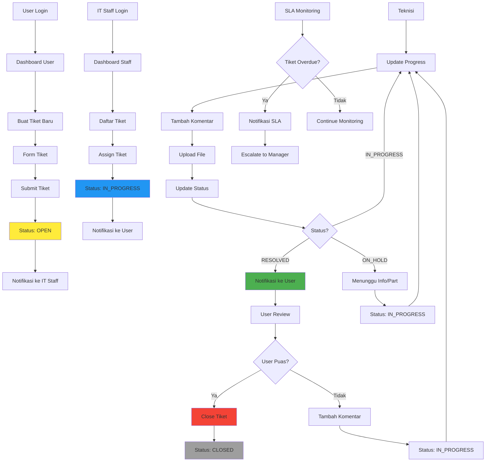
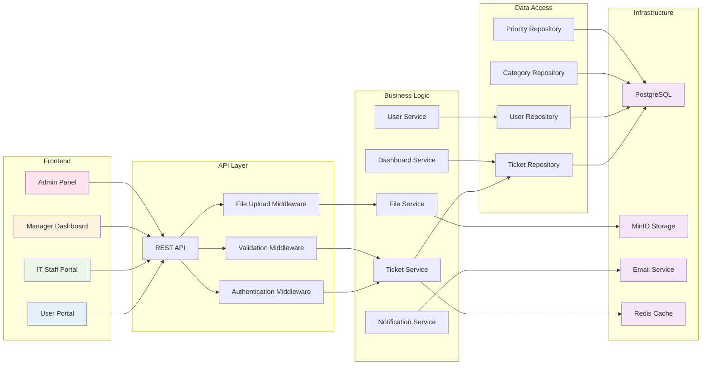
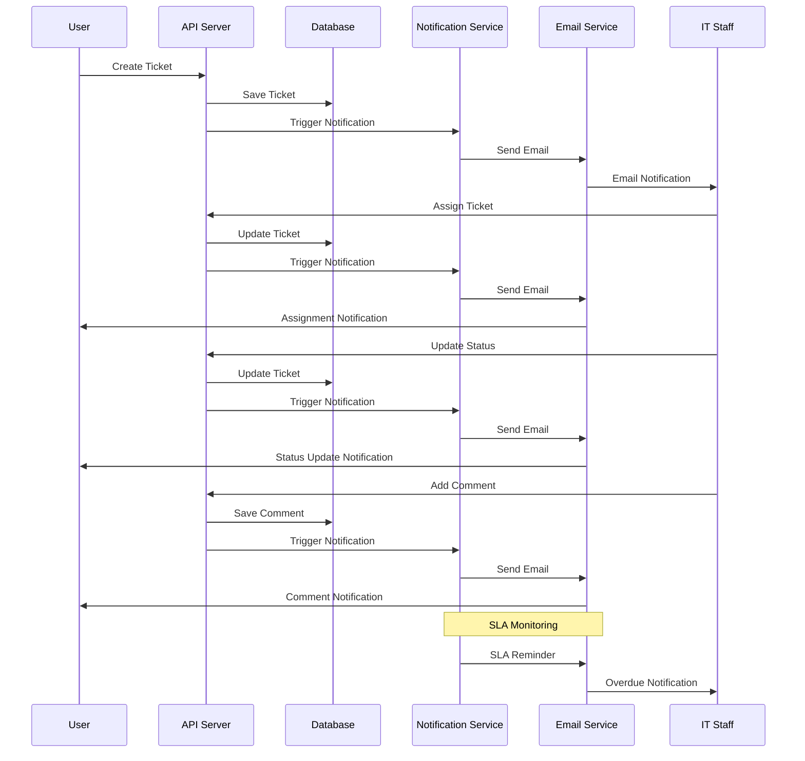
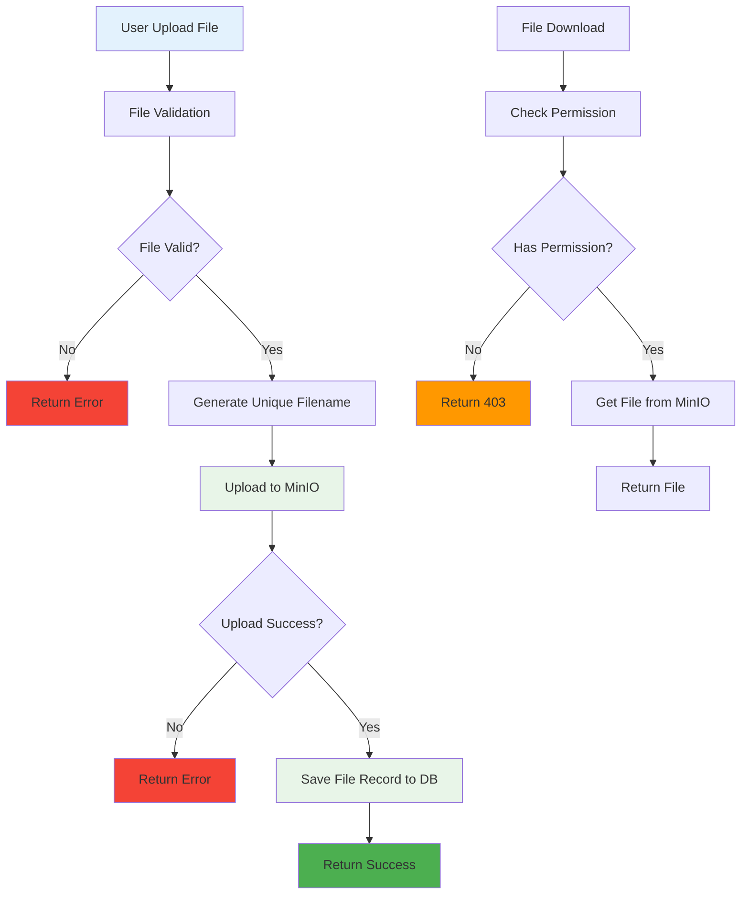
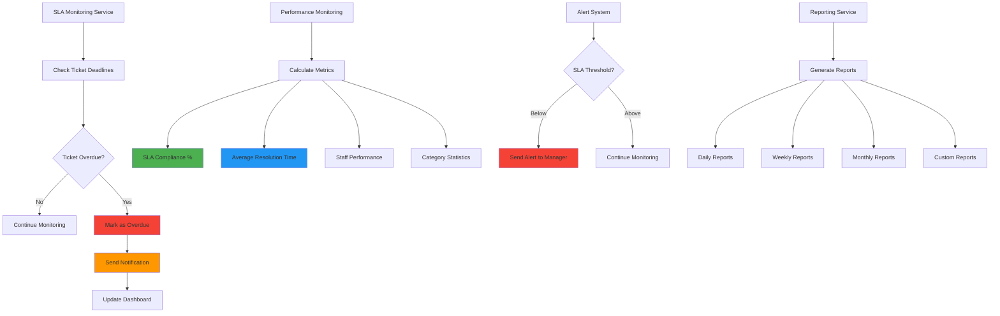
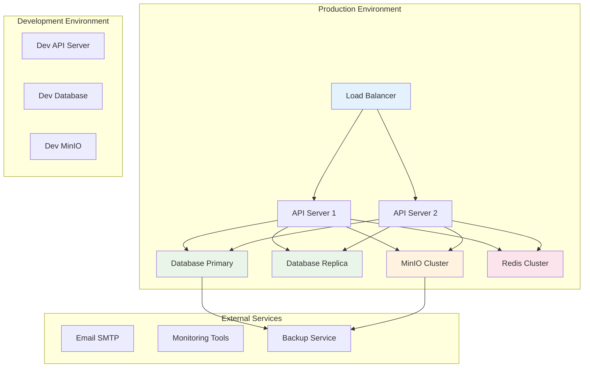

# 🏗️ Arsitektur Sistem IT Helpdesk / Ticketing System

## Diagram Arsitektur

## Diagram Database Schema

## Diagram Alur Tiket

## Diagram Komponen Sistem

## Diagram Role & Permission

```mermaid
graph TD
    A[User Login] --> B{Role Check}
    
    B -->|User| C[User Portal]
    B -->|IT Staff| D[IT Staff Portal]
    B -->|Manager| E[Manager Dashboard]
    B -->|Admin| F[Admin Panel]
    
    C --> C1[View Own Tickets]
    C --> C2[Create New Ticket]
    C --> C3[Add Comments]
    C --> C4[Upload Attachments]
    C --> C5[Close Own Tickets]
    
    D --> D1[View All Tickets]
    D --> D2[Assign Tickets]
    D --> D3[Update Ticket Status]
    D --> D4[Add Internal Comments]
    D --> D5[Upload Solution Files]
    D --> D6[View SLA Status]
    
    E --> E1[View All Tickets]
    E --> E2[View Reports]
    E --> E3[Monitor SLA]
    E --> E4[View Staff Performance]
    E --> E5[Export Reports]
    
    F --> F1[Manage Users]
    F --> F2[Manage Categories]
    F --> F3[Manage Priorities]
    F --> F4[Manage SLA Rules]
    F --> F5[System Configuration]
    F --> F6[View All Data]
    
    style C fill:#e3f2fd
    style D fill:#e8f5e8
    style E fill:#fff3e0
    style F fill:#fce4ec
```

## Diagram Notifikasi

## Diagram File Upload Flow

## Diagram Monitoring & SLA

## Teknologi Stack

### Backend
- **Node.js** - Runtime environment
- **Express.js** - Web framework
- **Knex.js** - SQL query builder
- **PostgreSQL** - Database
- **Joi** - Data validation
- **Multer** - File upload handling

### Authentication & Security
- **SSO** - Single Sign-On integration
- **JWT** - Token-based authentication
- **bcrypt** - Password hashing
- **CORS** - Cross-origin resource sharing
- **XSS Protection** - Cross-site scripting protection

### File Storage & Media
- **MinIO** - Object storage
- **Multer** - File upload middleware
- **Sharp** - Image processing

### Communication
- **Nodemailer** - Email service
- **RabbitMQ** - Message queue (optional)
- **WebSocket** - Real-time communication (optional)

### Monitoring & Logging
- **Winston** - Logging
- **Morgan** - HTTP request logger
- **Custom Monitoring** - SLA tracking

### Development Tools
- **ESLint** - Code linting
- **Prettier** - Code formatting
- **Jest** - Testing framework
- **Docker** - Containerization

## Deployment Architecture

Sistem IT Helpdesk / Ticketing System ini dirancang dengan arsitektur yang scalable, maintainable, dan secure. Semua komponen terintegrasi dengan baik dan mendukung berbagai skenario penggunaan sesuai dengan kebutuhan organisasi.
